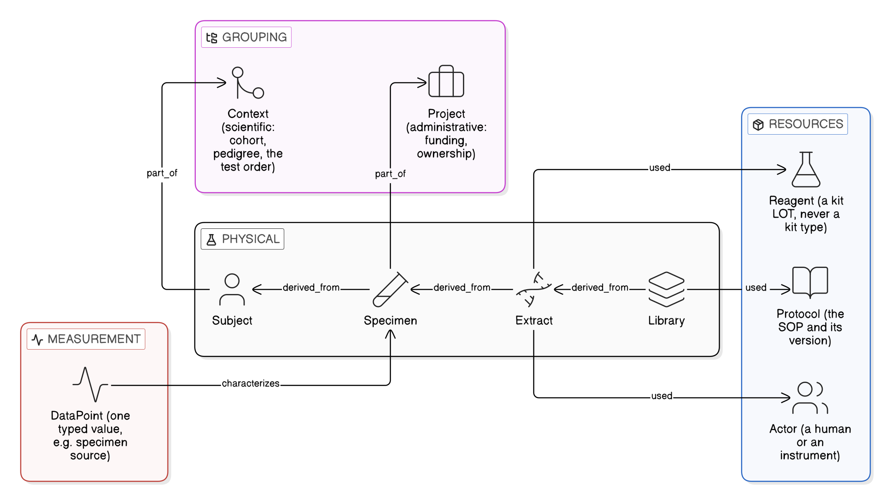
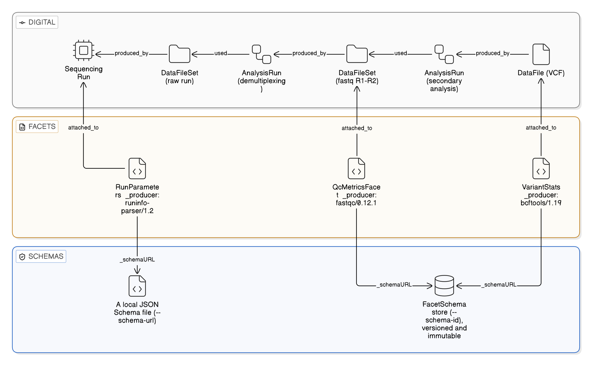
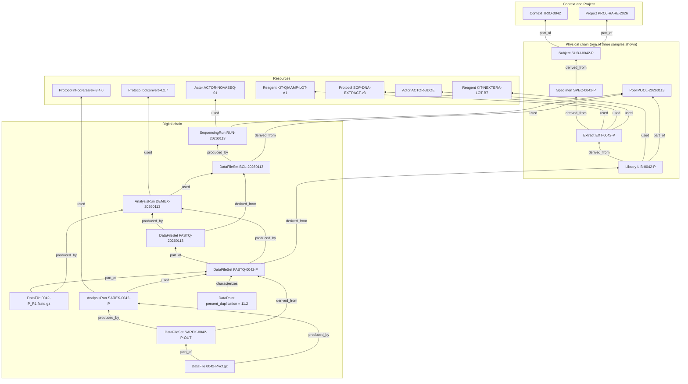

# The OpenNGS data model

What the entities and edges mean, what each one is for, and how a real sequencing lab's
work maps onto them. Read this before building a graph; `docs/worked-example.md` then
builds one end to end.

The whole model is fifteen entity types and six edge types. That is deliberate. The set is
closed: adding to it is a major version of the standard. Everything a lab varies on
(kit fields, instrument settings, QC panels, local business rules) lives in **facets** and
**DataPoints** attached to those fifteen types, never in new entity types or new columns.
This is the single rule that keeps OpenNGS a standard rather than a configurable schema:
*freeze the topology, extend the nodes.*


The backbone, from a person to a variant call. Green is material, orange is data. The two
halves meet at the sequencing run, which `used` a `Pool` and whose raw output set is
`derived_from` that same pool; from there the per-sample FASTQ set carries sample identity
back to its `Library`, so every file is traceable to the tube it came from without passing
through the pool's other samples.

## How to read the graph

Every entity is a node. Every relationship is an edge with a fixed direction. The
direction conventions are the same everywhere:

| Edge | Direction | Read it as |
|---|---|---|
| `derived_from` | child → parent | "this came from that" |
| `part_of` | member → container | "this belongs to that group" |
| `produced_by` | output → process | "this was made by that run" |
| `used` | process → resource | "that run consumed this" |
| `characterizes` | measurement → thing | "this value describes that" |
| `same_as` | record → record | "these two records are one real thing" |

An entity carries only its identity: an opaque `internal_id`, a human-readable `name`, and
a list of `xrefs` (see [Identity](#identity)). It has no other fields. The exception is
`DataPoint`, whose whole reason to exist is a value.

## The physical chain

The chain of material from a person to a sequencer. Each step is a distinct entity because
each step is where a lab makes a decision, consumes a reagent lot, and can go wrong
independently of the others. That is what makes "which extraction kit lot correlates with
bad duplication rates" answerable.

### `Subject`

The source a specimen was taken from: a person, an organism, or an environmental
sampling site.

- **Intent:** the root of every physical chain. It exists so that two specimens from the
  same source can be recognized as such, and so a cohort, a pedigree, or a time series
  from one site has something to group.
- **Environmental sampling:** a lake, a river station, or a soil plot is a Subject. Every
  bottle taken there, on any date, is a `Specimen` derived from it, so "every sample from
  this site" is one traversal. Coordinates and ENVO terms are a facet on the Subject; a
  sampling trip is a `Context`; field replicates are sibling Specimens.
- **Is not:** a patient record. OpenNGS holds no demographics, phenotype, or diagnosis
  on a Subject. Phenotype belongs in a facet (Phenopackets is the recommended shape);
  clinical interpretation is out of scope entirely.
- **Edges:** none required at create time. Joins a `Context` (a cohort, a pedigree, an
  order) or a `Project` via `part_of`.

### `Specimen`

Material as collected, before any lab processing: a blood draw, a biopsy, a swab.

- **Intent:** the point where the physical world enters the lab. Everything downstream
  derives from it, and it is the entity external registries (BioSample, ENA) most often
  identify.
- **Required parent:** `derived_from` a `Subject`. A control that came from no subject,
  such as a mock community, is created with an explicit no-parent opt-out instead; see
  `docs/cli-design.md`.
- **Aliquots:** a tube split from a specimen is itself a `Specimen`, `derived_from` the
  original. There is no `Aliquot` entity. The same rule applies to `Extract`, `Library`,
  and `Pool`: a portion of a thing is another instance of that thing, linked to its
  parent. This keeps aliquoting a *relationship*, so any depth of splitting is
  representable with one predicate.
- **Typical detail:** specimen type and anatomy are facet fields, bound to NCIT and
  UBERON terms.

### `Extract`

Nucleic acid extracted from a specimen: DNA, RNA.

- **Intent:** the first process step that consumes a reagent lot and is performed by
  someone. Its `used` edges (kit lot, protocol, operator) are the raw material of QC
  forensics.
- **Required parent:** `derived_from` a `Specimen`.
- **Typical edges:** `used` a `Reagent` (the extraction kit lot), `used` a `Protocol`
  (the SOP and version), `used` an `Actor` (the operator).

### `Library`

A sequencing-ready library prepared from an extract.

- **Intent:** the last physical entity that is still one sample. It is what a
  per-sample FASTQ set traces back to.
- **Required parent:** `derived_from` an `Extract`.
- **Typical edges:** `used` a `Reagent` (library prep kit lot), `used` a `Protocol`,
  `used` an `Actor`; `part_of` a `Pool`.

### `Pool`

Several libraries combined to be sequenced together.

- **Intent:** the physical unit a sequencing run actually loads. It is where
  multiplexing happens, and where a run-level problem fans out to many samples.
- **Edges:** none required at create time. Members join afterwards: `Library`
  `part_of` `Pool`. A re-pooled portion is a `Pool` `derived_from` the original.

## The instrument

### `SequencingRun`

One execution of a sequencing instrument.

- **Intent:** the process that turns material into data. It is the bridge between the
  physical chain and the digital chain, and the unit run-level QC (cluster density,
  Q30) belongs to.
- **Edges:** `used` an `Actor` (the instrument itself; an instrument is an Actor, see
  below), `used` a `Protocol` (the run recipe), `used` the `Pool` or `Library` it loaded.
  Its output, a `DataFileSet` of raw run files, is `produced_by` it and `derived_from` the
  `Pool` it sequenced.

The run states its input and its output states its provenance, and both are worth keeping.
`SequencingRun used Pool` is true from the moment the run starts, which is what makes a run
that failed before producing anything still say what was on it. `DataFileSet derived_from
Pool` is true once there is an output to make it about. A single-sample run with no pooling
step `used` its `Library` directly; nothing loads a `Specimen` or an `Extract` onto a
sequencer, so neither is a valid target.

## The digital chain

Files and the runs that make them. OpenNGS never stores file contents. A `DataFile` is a
reference; where the bytes live is an `xref` (a GA4GH DRS URI or a plain URI).

### `DataFile`

A reference to one data payload: a FASTQ, a BAM, a VCF, a QC report.

- **Intent:** the digital counterpart of a `Specimen`: the concrete thing downstream
  work reads. Individual files matter when lineage or QC needs to attach to exactly
  one of them.
- **Required parent:** `produced_by` a `SequencingRun` or an `AnalysisRun`.
- **Optional at create:** `derived_from` one or more other `DataFile`s, for
  file-level lineage (a BAM from its two FASTQs, a VCF from its BAM).
- **Edges:** `part_of` a `DataFileSet`.

### `DataFileSet`

A named group of files produced together by one run: a raw run folder, one sample's
FASTQ pair, a pipeline's complete output directory.

- **Intent:** the unit real pipelines actually consume and produce. Labs rarely reason
  about single files; they reason about "the FASTQ output for sample X" or "the sarek
  output for this run". A `DataFileSet` gives that unit an identity that QC, facets,
  and `used` edges can attach to.
- **Required parent:** `produced_by` a `SequencingRun` or an `AnalysisRun`.
- **Nesting:** a `DataFileSet` may be `part_of` another. The standard case is a
  multi-sample demultiplexing run: one set for the whole run's output, and inside it
  one set per sample. The per-sample set is what a secondary pipeline `used`.
- **Edges:** `derived_from` the material or set it came from (the raw run folder
  `derived_from` the `Pool`; a per-sample FASTQ set `derived_from` its `Library`).

A `DataFileSet` does not have to enumerate every member file. Registering the set alone,
with its location as an `xref`, is a valid level of detail. Add member `DataFile`s when
something needs to attach to one file specifically.

### `AnalysisRun`

One execution of a pipeline or tool: a demultiplexing run, a secondary-analysis pipeline
run, a QC aggregation.

- **Intent:** the digital process, the counterpart of `SequencingRun`. One
  `AnalysisRun` per pipeline *invocation*, not per internal step. That is how labs
  actually track work, and it keeps the graph readable. A lab that wants step-level
  provenance can model steps as further `AnalysisRun`s.
- **Edges:** `used` a `Protocol` (the pipeline's identity and version), `used` the
  `DataFile` or `DataFileSet` it took as input, `used` an `Actor` (a compute platform,
  an analyst). Its outputs are `produced_by` it.
- **Outcome:** how the run ended is recorded as `DataPoint`s characterizing the run,
  never as a status field. `schema/vocabularies/datapoints.yaml` defines the terms:
  `openngs-dp:run_outcome` (`succeeded`, `failed`, `aborted`, `partial`),
  `openngs-dp:exit_status`, `openngs-dp:run_duration_seconds`,
  `openngs-dp:run_started_at`, `openngs-dp:run_finished_at`, `openngs-dp:error_summary`.
  A platform's own run ID is an xref, and the full log stays a `DataFile`.

  ```bash
  openngs datapoint create SAREK-0042-P-outcome --for SAREK-0042-P \
    --type openngs-dp:run_outcome --kind text --value failed
  openngs datapoint create SAREK-0042-P-exit --for SAREK-0042-P \
    --type openngs-dp:exit_status --kind number --value 137
  ```

  These are facts about what happened, recorded after the fact. Nothing in OpenNGS reads
  them, and no consumer should treat them as readiness signals: a run's outcome is
  history, not an instruction. The same terms apply to a `SequencingRun`.

Recording what a run `used` is a direct statement of its inputs. It does not depend on
every output file also carrying a `derived_from` edge, and it stays true even for
outputs (logs, reports) that have no meaningful file-level ancestry.

## Contextual entities

Things that give the chain meaning but are not themselves material or data.



None of them sits *in* the lineage; each attaches to it, and there are only three ways to
do that. `used` records what a step consumed - a `Reagent` lot and an `Actor` on the
extraction, a `Protocol` on the library prep. `part_of` groups, and the two groupings
attach wherever they belong: the `Subject` joins a `Context` (the family, the order) while
the `Specimen` joins a `Project`. `characterizes` points a `DataPoint` at whatever it
measures.

### `Protocol`

A documented procedure: a wet-lab SOP and its version, or a pipeline and its version.

- **Intent:** to make "which version of the method" a first-class node that many runs
  point at, rather than a string repeated on each run. `nf-core/sarek-3.4.0` and
  `SOP-DNA-EXTRACTION-v3` are both Protocols. There is no separate pipeline entity.
- **Edges:** the target of `used`.
- **Detail:** container digests, git commits, parameter sets are facet fields on the
  Protocol.

### `Reagent`

A kit **lot**, not a kit type.

- **Intent:** lot-level granularity is the point of the entity. The forensic question
  is never "did we use the QIAamp kit" but "did lot A1 correlate with failures". A
  Reagent node per lot makes that a graph traversal.
- **Edges:** the target of `used`.
- **Detail:** manufacturer, catalogue number, expiry are facet fields.

### `Actor`

A human or an instrument that performed or operated a process.

- **Intent:** one entity for both, because the question "who or what did this" has
  one answer shape regardless. Which kind it is, and its serial number or staff ID,
  are facet fields.
- **Edges:** the target of `used`; also the `asserted_by` of a `same_as` edge.

### `Project`

An administrative grouping: a study, a grant, a customer order.

- **Intent:** ownership, funding, and billing scope. It answers "whose samples are
  these" and "which order does this belong to".
- **Edges:** any entity joins via `part_of`.

### `Context`

A scientific or analytical grouping: a cohort, a pedigree, a case, a control set.

- **Intent:** to group entities for a scientific reason without inventing a new entity
  type for each kind of grouping. A trio is a `Context` holding three `Subject`s. A
  case-control cohort is a `Context` holding `Specimen`s. A **clinical test order** is
  a `Context`: the subject, the specimens, and eventually the output files join it, and
  the order's details (test code, ordering clinician, priority) are a facet on it. A
  **sampling campaign** is a `Context` holding the specimens collected on one trip.
  `Context` and `Project` cut across each other freely: one study may span several
  trios, and one trio may appear in several studies.
- **Edges:** any entity joins via `part_of`. A member's role (proband, affected,
  control) is a facet on that `part_of` edge, not a core field.

### `DataPoint`

One atomic, independently correctable measurement or fact: a QC metric, a flag, a
value imported from another system.

- **Intent:** to give the specific values worth querying across the whole graph a
  typed, indexed home. `DataPoint` is the one entity that carries fields beyond its
  identity: `datapoint_type` (a CURIE naming what was measured), `value_kind`
  (`number`, `text`, or `boolean`), and exactly one of `value_number`, `value_text`,
  `value_boolean`.
- **Required parent:** `characterizes` the entity it describes, of any type.
- **Vocabulary:** use a term from `schema/vocabularies/datapoints.yaml`
  (`openngs-dp:percent_duplication`) when one exists, or a vendor or institution CURIE
  (`acme-lims:sample-priority`) otherwise. The set is not closed.

## Facets and DataPoints: which one

Both attach extra information to an entity or edge. They answer different needs.



Facets along the analysis half of the chain: run settings on the `SequencingRun`, a QC
report on the FASTQ set, variant statistics on the VCF. Each declares its `_producer` and
points at whatever validates it - a local JSON Schema file, or an entry in the registered
schema store. Only `qc_metrics` exists in this repository
(`docs/facets/examples/qc_metrics/`); the other two are illustrative.

| | Facet | DataPoint |
|---|---|---|
| Shape | Many fields, one schema, validated as a unit | One value |
| Best for | A tool's full report (FastQC, DRAGEN), kit metadata, instrument settings, a role on a membership edge | A single metric or fact you will filter, group, or aggregate on |
| Storage | JSON, validated against the facet's own schema | Typed columns |
| Corrected as | The whole facet, when the tool is re-run | That one value |
| Who defines it | You, in your own namespace, in LinkML | The `datapoint_type` CURIE, from a vocabulary |

Keep a tool report whole as a facet. Promote the handful of fields you actually query
across samples into `DataPoint`s. Both can describe the same entity.

Every facet declares its `_producer` (what wrote it) and `_schemaURL` (what validates it),
so a consumer that has never seen your facet can still check it. No facet is part of the
core standard. One is promoted only when two independent implementations need the same
shape to interoperate; see `docs/facets/authoring-a-facet.md`.

## Identity

Three layers, on every entity:

```
internal_id   UUIDv7 - opaque, immutable, never derived from anything meaningful
name          openngs://{org}/{namespace}/{entity_type}/{local_id}
xrefs         ["biosample:SAMN12345678", "barcode:TUBE-00417", "drs://..."]
```

`local_id` is whatever your source system already calls the thing. A LIMS registers its
own accession numbers as `local_id`s on day one with no ID migration. Every CLI and API
reference (`REF`) accepts any of the three forms: a bare `local_id` resolved against the
active org and namespace, a full `name`, or an `internal_id`.

`xrefs` are CURIEs using Bioregistry prefixes, or URIs. They are additive and never
authoritative: they record that another system knows this entity by that identifier. One
can be added at any time after creation, which is the normal case for an accession that
comes back from an archive weeks later. Removing one is a correction, because it says the
identifier was wrong.

### `same_as` is an assertion, never a merge

When two records turn out to describe one real thing (a specimen registered twice, one
lab's sample matching another's), OpenNGS records a `same_as` edge between them carrying
who asserted it (`asserted_by`, an `Actor`), when (`asserted_at`), how (`method`:
`barcode_scan`, `operator_claim`, `fingerprint_concordance`, ...) and how sure
(`confidence`, 0 to 1). The two nodes stay separate.

Merging is unrecoverable: once two nodes are one, a later discovery that the assertion
was wrong cannot be undone. Deduplication is instead a *query-time* choice, resolved at
whatever confidence threshold the caller wants. This is also what lets two labs disagree
about identity without either one's record being overwritten.

## Time and the event log

Every write to OpenNGS is an event in an append-only log, using the CloudEvents 1.0
envelope. The graph you query is a projection of that log and can be rebuilt from it at
any time. Nothing in the log is ever updated or deleted.

Every event carries two timestamps:

- `valid_time`: when the fact was true in the lab. Supplied by the caller; defaults to now.
- `transaction_time`: when OpenNGS learned it. Always now, never supplied.

They diverge constantly. An operator records Monday's extraction on Wednesday; a LIMS
import backfills last year's runs. Keeping both means "what was true of this library on
3 March" and "what did we believe about it on 3 March" are both answerable, and the second
is usually the one that explains a bad decision.

## Corrections

Nothing recorded is ever edited or deleted. A correction is a new event carrying
`supersedes` (the last event about that record) and a required `supersede_reason`, and the
graph you read is the result of applying every event in order. There are two shapes:

- **Correct** the content of a record that should exist: an entity's local ID or xrefs, a
  `DataPoint`'s value, a facet's data. The record stays believed and now says something
  different; what it said before is in the log.
- **Retract** a record that should never have existed, or a relationship that is false.
  It stops appearing in reads but stays in the database, visible on request, along with
  the event that withdrew it.

A sample swap is normally fixed by retracting the wrong edge and creating the right one,
not by touching either entity. Retracting an entity that still has edges is refused unless
you ask for them to be retracted with it, so no lineage disappears by accident. A
correction can itself be corrected without limit; what is refused is superseding an event
that something already supersedes, so each record's history stays a single line.

Every projection row carries `valid_time` (the lab time of the event that last set its
content) and, once withdrawn, `retracted_at` and `retracted_by_event`. `retracted_at` is a
*transaction* time on purpose: a retraction is a change of belief, not a change of what was
true in the lab.

## What OpenNGS deliberately does not model

- **No `next_step` edge and no status field.** Process state ("ready for sequencing",
  "QC failed") is derived from the graph and the events, never stored as the answer.
  This is what keeps OpenNGS from becoming a workflow engine: it records what happened;
  consumers decide what happens next.
- **No plate maps, wells, or liquid-handling detail.** That is wet-lab operation, a
  LIMS's job. A plate position is at most an `xref`.
- **No file contents.** A `DataFile` is a reference.
- **No diagnoses.** Provenance, not interpretation.

## A complete example

A clinical trio (proband and both parents), whole-genome sequenced on one run, analysed
per sample. `docs/worked-example.md` builds exactly this with the CLI.



Reading it bottom-up from the VCF: the variant calls came from a sarek run that consumed
this sample's FASTQ set, which the demultiplexing run cut out of the raw run folder, which
the sequencer produced from a pool containing this sample's library, which was prepared
from DNA extracted with kit lot A1 by this operator from a blood specimen from the proband
of trio 0042. Every hop is one edge, and every edge is one event with a lab date and a
record date.
