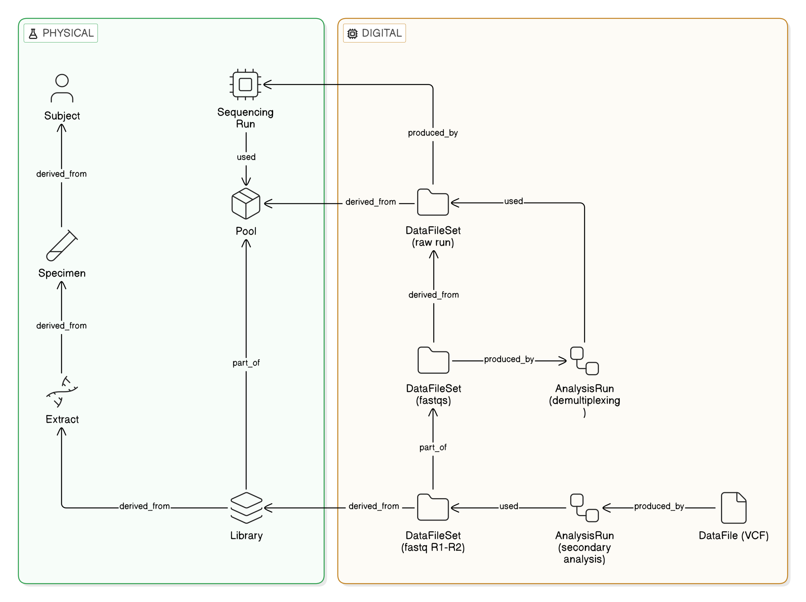

# Worked example: a clinical trio, from blood draw to variant calls

A complete, realistic lineage graph built with the CLI, then queried three ways (CLI,
REST, GraphQL). It is the graph drawn at the end of `docs/data-model.md`: a proband and
both parents, whole-genome sequenced together on one run, demultiplexed, and analysed per
sample with a versioned pipeline.

The whole build is one script, `docs/examples/clinical-trio.sh`. Every line in it is an
ordinary `openngs` command; this page walks through it in sections and then shows what
the finished graph can answer.

Sections 1 to 4 below are also available as a spreadsheet,
`docs/examples/intake-manifest.tsv`, loaded in one command with `openngs ingest manifest`.
That is closer to how a lab receives intake data in practice; see
[manifests](manifest.md).

```bash
make db                                  # fresh SQLite database
export OPENNGS_ORG=acme-genomics OPENNGS_NAMESPACE=core-lab OPENNGS_DB_URL=sqlite:///openngs.db
bash docs/examples/clinical-trio.sh
```



The shape this script builds, one sample's worth. The trio runs the physical chain three
times into one `Pool`, and the digital half once per sample from the demultiplexed FASTQ
set onward.

## Building the graph

### 1. Context: the study and the family

```bash
openngs project create PROJ-RARE-2026
openngs context create TRIO-0042
```

`Project` is the administrative grouping (the study, the order). `Context` is the
scientific one (this family). Subjects will join both.

### 2. Shared resources

The people, instruments, kit lots, and protocols every sample will point at. Creating
them once, up front, is what makes "every extract that used lot A1" a single lookup
later.

```bash
openngs actor create ACTOR-JDOE              --xref orcid:0000-0002-1825-0097
openngs actor create ACTOR-NOVASEQ-01        --xref "illumina.serial:A01234"
openngs reagent create KIT-QIAAMP-LOT-A1     --xref "qiagen.lot:172345678"
openngs reagent create KIT-NEXTERA-LOT-B7    --xref "illumina.lot:20654321"
openngs protocol create SOP-DNA-EXTRACT-v3
openngs protocol create SOP-LIB-PREP-v2
openngs protocol create bclconvert-4.2.7
openngs protocol create nf-core/sarek-3.4.0  --xref "doi:10.5281/zenodo.3476425"
```

An operator and an instrument are both `Actor`s. A wet-lab SOP and a pipeline release
are both `Protocol`s. A `Reagent` is a specific lot.

### 3. The physical chain, per sample

For each of the three samples (`P`, `M`, `F`):

```bash
openngs subject create SUBJ-0042-P
openngs link part-of --from SUBJ-0042-P --to TRIO-0042
openngs link part-of --from SUBJ-0042-P --to PROJ-RARE-2026

# Blood drawn on 8 Jan; the LIMS barcode is its external identifier.
openngs specimen create SPEC-0042-P --subject SUBJ-0042-P \
  --xref barcode:TUBE-0042-P --valid-time 2026-01-08T10:30:00

# DNA extracted on Monday 12 Jan, recorded today.
openngs extract create EXT-0042-P --specimen SPEC-0042-P --valid-time 2026-01-12T09:00:00
openngs link used --from EXT-0042-P --to KIT-QIAAMP-LOT-A1  --valid-time 2026-01-12T09:00:00
openngs link used --from EXT-0042-P --to SOP-DNA-EXTRACT-v3 --valid-time 2026-01-12T09:00:00
openngs link used --from EXT-0042-P --to ACTOR-JDOE         --valid-time 2026-01-12T09:00:00

openngs library create LIB-0042-P --extract EXT-0042-P --valid-time 2026-01-13T11:00:00
openngs link used --from LIB-0042-P --to KIT-NEXTERA-LOT-B7 --valid-time 2026-01-13T11:00:00
openngs link used --from LIB-0042-P --to SOP-LIB-PREP-v2    --valid-time 2026-01-13T11:00:00
```

Two things to notice. `create` requires the one structural parent an entity cannot
exist without (`--subject`, `--specimen`, `--extract`); everything else is a `link`
afterwards. And `--valid-time` records when the work happened in the lab, independently
of when you ran the command. Both dates are kept.

### 4. Pool and sequence

```bash
openngs pool create POOL-20260113
openngs link part-of --from LIB-0042-P --to POOL-20260113     # and M, F

openngs sequencing-run create RUN-20260113 --valid-time 2026-01-13T18:00:00
openngs link used --from RUN-20260113 --to ACTOR-NOVASEQ-01

openngs data-file-set create BCL-20260113 --produced-by RUN-20260113 \
  --xref "s3://acme-seq/runs/20260113/" --valid-time 2026-01-15T06:00:00
openngs link derived-from --from BCL-20260113 --to POOL-20260113
```

The raw run folder is a `DataFileSet`: produced by the run, and `derived_from` the pool
it sequenced. That last edge is the bridge from material to data. The run itself is the
process on the boundary, not a link in the material chain, and the instrument is an
`Actor` the run `used`.

The set's location is an `xref`. OpenNGS stores references to files, never files.

### 5. Demultiplex

```bash
openngs analysis-run create DEMUX-20260113 --valid-time 2026-01-15T07:00:00
openngs link used --from DEMUX-20260113 --to bclconvert-4.2.7
openngs link used --from DEMUX-20260113 --to BCL-20260113

openngs data-file-set create FASTQ-20260113 --produced-by DEMUX-20260113 \
  --xref "s3://acme-seq/fastq/20260113/"
openngs link derived-from --from FASTQ-20260113 --to BCL-20260113

# per sample:
openngs data-file-set create FASTQ-0042-P --produced-by DEMUX-20260113
openngs link part-of      --from FASTQ-0042-P --to FASTQ-20260113
openngs link derived-from --from FASTQ-0042-P --to LIB-0042-P

openngs data-file create 0042-P_R1.fastq.gz --produced-by DEMUX-20260113 \
  --xref "drs://drs.acme.example/fastq/0042-P_R1"
openngs link part-of --from 0042-P_R1.fastq.gz --to FASTQ-0042-P
# and R2
```

An `AnalysisRun` states its inputs directly with `used`. Its output is one set for the
whole run, with one nested set per sample inside it. The per-sample set is the thing
downstream analysis consumes, so it gets its own identity, and it is `derived_from` the
library it was sequenced from: the second material-to-data bridge, one per sample.

### 6. Secondary analysis, per sample

```bash
openngs analysis-run create SAREK-0042-P --valid-time 2026-01-16T02:00:00
openngs link used --from SAREK-0042-P --to nf-core/sarek-3.4.0
openngs link used --from SAREK-0042-P --to FASTQ-0042-P

openngs data-file-set create SAREK-0042-P-OUT --produced-by SAREK-0042-P \
  --xref "s3://acme-seq/sarek/0042-P/"
openngs link derived-from --from SAREK-0042-P-OUT --to FASTQ-0042-P

openngs data-file create 0042-P.bam --produced-by SAREK-0042-P \
  --derived-from 0042-P_R1.fastq.gz --derived-from 0042-P_R2.fastq.gz
openngs data-file create 0042-P.vcf.gz --produced-by SAREK-0042-P --derived-from 0042-P.bam
openngs link part-of --from 0042-P.bam    --to SAREK-0042-P-OUT
openngs link part-of --from 0042-P.vcf.gz --to SAREK-0042-P-OUT
```

One `AnalysisRun` per pipeline invocation. The pipeline's identity and version is a
`Protocol`. File-level `derived_from` edges (BAM from FASTQs, VCF from BAM) are added
where they are worth having, not everywhere.

### 7. QC

```bash
openngs facet schema register qc-metrics \
  --file docs/facets/examples/qc_metrics/qc_metrics.schema.json

openngs facet attach --to 0042-P_R1.fastq.gz --schema-id qc-metrics \
  --type QcMetricsFacet --producer "fastqc/0.12.1" \
  --data '{"tool":"fastqc","sample_name":"0042-P","metric_name":"openngs-dp:percent_duplication","metric_value":11.2}'

openngs datapoint create 0042-P-percent-duplication --for FASTQ-0042-P \
  --type openngs-dp:percent_duplication --kind number --value 11.2
openngs datapoint create 0042-P-mean-coverage --for 0042-P.bam \
  --type openngs-dp:mean_coverage --kind number --value 31.4
```

The facet keeps a tool's report whole, validated against a schema registered once in the
database. The `DataPoint`s pull out the two values worth querying across every sample
in the lab, typed and indexed, and attach them to the thing they describe.

### 8. Identity

```bash
openngs specimen create LIMS-88213 --subject SUBJ-0042-P --xref barcode:TUBE-0042-P
openngs link same-as --from LIMS-88213 --to SPEC-0042-P \
  --asserted-by ACTOR-JDOE --method barcode_scan --confidence 1.0
```

The LIMS registered the proband's tube under its own accession. Rather than merging the
two records, OpenNGS records that an operator asserted they are the same tube, by
scanning the barcode, with full confidence. Both records survive; a query decides how to
treat the pair.

## Querying the graph

### CLI: one record and everything touching it

```
$ openngs data-file show 0042-P.vcf.gz
DataFile  openngs://acme-genomics/core-lab/data-file/0042-P.vcf.gz
internal_id: 01a07a0f-ad4e-73e0-bdf4-0bdc3032065b
xrefs: (none)

Outgoing:
  produced_by → AnalysisRun  openngs://acme-genomics/core-lab/analysis-run/SAREK-0042-P
  derived_from → DataFile  openngs://acme-genomics/core-lab/data-file/0042-P.bam
  part_of → DataFileSet  openngs://acme-genomics/core-lab/data-file-set/SAREK-0042-P-OUT

Incoming:
  (none)
```

The forensic question the model exists for, "what used this kit lot", is a `show` on the
lot:

```
$ openngs reagent show KIT-QIAAMP-LOT-A1
Reagent  openngs://acme-genomics/core-lab/reagent/KIT-QIAAMP-LOT-A1
internal_id: 01a07a0f-7d95-77f7-8d6e-e526a1df4bad
xrefs: qiagen.lot:172345678

Outgoing:
  (none)

Incoming:
  used ← Extract  openngs://acme-genomics/core-lab/extract/EXT-0042-P
  used ← Extract  openngs://acme-genomics/core-lab/extract/EXT-0042-M
  used ← Extract  openngs://acme-genomics/core-lab/extract/EXT-0042-F
```

QC values for one sample's FASTQ set, and the events behind one specimen, including the
identity assertion and both timestamps:

```
$ openngs datapoint list --for FASTQ-0042-P
01a07a0f-bb6e-...  openngs://acme-genomics/core-lab/datapoint/0042-P-percent-duplication  openngs-dp:percent_duplication=11.2

$ openngs specimen show SPEC-0042-P --events
Specimen  openngs://acme-genomics/core-lab/specimen/SPEC-0042-P
internal_id: 01a07a0f-8300-743e-a253-2eeaeb028986
xrefs: barcode:TUBE-0042-P

Outgoing:
  derived_from → Subject  openngs://acme-genomics/core-lab/subject/SUBJ-0042-P

Incoming:
  derived_from ← Extract  openngs://acme-genomics/core-lab/extract/EXT-0042-P
  same_as ← Specimen  openngs://acme-genomics/core-lab/specimen/LIMS-88213  [asserted_by=01a07a0f-7c64-... method=barcode_scan confidence=1.0]

Events:
  01a07a0f-8300-...  entity_created  valid_time=2026-01-08T10:30:00+00:00
  01a07a0f-8300-...  edge_created  valid_time=2026-01-08T10:30:00+00:00
  01a07a0f-839d-...  edge_created  valid_time=2026-01-12T09:00:00+00:00
  01a07a0f-c117-...  same_as_edge_created  valid_time=2026-09-07T04:10:47+00:00
```

Rebuilding the whole graph from the log changes nothing:

```
$ openngs event replay --yes
replayed 161 events
```

### REST: the same shapes over HTTP

With `make api` running against the same database:

```bash
curl -s localhost:8000/data-file-sets/FASTQ-0042-P | jq .
```

```json
{
  "type": "DataFileSet",
  "internal_id": "01a07a0f-9cee-7100-a0ba-ace87193839d",
  "name": "openngs://acme-genomics/core-lab/data-file-set/FASTQ-0042-P",
  "xrefs": [],
  "outgoing": [
    {"predicate": "produced_by", "other_type": "AnalysisRun", "other_id": "...", "other_name": "openngs://acme-genomics/core-lab/analysis-run/DEMUX-20260113"},
    {"predicate": "part_of", "other_type": "DataFileSet", "other_id": "...", "other_name": "openngs://acme-genomics/core-lab/data-file-set/FASTQ-20260113"},
    {"predicate": "derived_from", "other_type": "Library", "other_id": "...", "other_name": "openngs://acme-genomics/core-lab/library/LIB-0042-P"}
  ],
  "incoming": [
    {"predicate": "part_of", "other_type": "DataFile", "other_id": "...", "other_name": "openngs://acme-genomics/core-lab/data-file/0042-P_R1.fastq.gz"},
    {"predicate": "part_of", "other_type": "DataFile", "other_id": "...", "other_name": "openngs://acme-genomics/core-lab/data-file/0042-P_R2.fastq.gz"},
    {"predicate": "used", "other_type": "AnalysisRun", "other_id": "...", "other_name": "openngs://acme-genomics/core-lab/analysis-run/SAREK-0042-P"},
    {"predicate": "derived_from", "other_type": "DataFileSet", "other_id": "...", "other_name": "openngs://acme-genomics/core-lab/data-file-set/SAREK-0042-P-OUT"},
    {"predicate": "characterizes", "other_type": "DataPoint", "other_id": "...", "other_name": "openngs://acme-genomics/core-lab/datapoint/0042-P-percent-duplication"}
  ]
}
```

That one response shows the per-sample FASTQ set's whole neighbourhood: what made it,
what it nests in, which library it came from, its member files, the pipeline that
consumed it, the output set that came from it, and the QC value describing it.

```bash
curl -s "localhost:8000/datapoints?for=FASTQ-0042-P" | jq .
```

```json
[
  {
    "internal_id": "01a07a0f-bb6e-7712-99e8-39c138ad8bb4",
    "name": "openngs://acme-genomics/core-lab/datapoint/0042-P-percent-duplication",
    "datapoint_type": "openngs-dp:percent_duplication",
    "value_kind": "number",
    "value_number": 11.2,
    "value_text": null,
    "value_boolean": null
  }
]
```

### GraphQL: walk the lineage in one request

From a VCF back to the pool, the library, and the kit lots, in one query. Inline
fragments (`... on Library`) say where to keep walking, and the walk stops everywhere
else.

```graphql
{
  dataFile(ref: "0042-P.vcf.gz") {
    name
    outgoing {
      predicate
      other {
        name
        ... on AnalysisRun {
          outgoing { predicate other { name
            ... on DataFileSet {
              outgoing { predicate other { name
                ... on Library { outgoing { predicate other { name } } }
              } }
            }
          } }
        }
      }
    }
  }
}
```

Trimmed response:

```json
{
  "dataFile": {
    "name": ".../data-file/0042-P.vcf.gz",
    "outgoing": [
      {"predicate": "produced_by", "other": {
        "name": ".../analysis-run/SAREK-0042-P",
        "outgoing": [
          {"predicate": "used", "other": {"name": ".../protocol/nf-core/sarek-3.4.0"}},
          {"predicate": "used", "other": {
            "name": ".../data-file-set/FASTQ-0042-P",
            "outgoing": [
              {"predicate": "produced_by", "other": {"name": ".../analysis-run/DEMUX-20260113"}},
              {"predicate": "part_of",     "other": {"name": ".../data-file-set/FASTQ-20260113"}},
              {"predicate": "derived_from", "other": {
                "name": ".../library/LIB-0042-P",
                "outgoing": [
                  {"predicate": "derived_from", "other": {"name": ".../extract/EXT-0042-P"}},
                  {"predicate": "used",         "other": {"name": ".../reagent/KIT-NEXTERA-LOT-B7"}},
                  {"predicate": "used",         "other": {"name": ".../protocol/SOP-LIB-PREP-v2"}},
                  {"predicate": "part_of",      "other": {"name": ".../pool/POOL-20260113"}}
                ]
              }}
            ]
          }}
        ]
      }},
      {"predicate": "derived_from", "other": {"name": ".../data-file/0042-P.bam"}},
      {"predicate": "part_of",      "other": {"name": ".../data-file-set/SAREK-0042-P-OUT"}}
    ]
  }
}
```

The reverse direction, from a kit lot forward to every library made with it:

```graphql
{
  reagent(ref: "KIT-QIAAMP-LOT-A1") {
    incoming { predicate other { name
      incoming { predicate other { name } }
    } }
  }
}
```

returns the three extracts and, under each, the library derived from it. And the
identity assertion, with its evidence:

```graphql
{ specimen(ref: "SPEC-0042-P") { incoming { predicate assertedBy method confidence other { name } } } }
```

```json
{"predicate": "same_as", "assertedBy": "01a07a0f-7c64-...", "method": "barcode_scan", "confidence": 1.0,
 "other": {"name": ".../specimen/LIMS-88213"}}
```

### Both timestamps, everywhere

```graphql
{ events(ref: "EXT-0042-P", limit: 2) { type validTime transactionTime } }
```

```json
{"type": "entity_created", "validTime": "2026-01-12T09:00:00+00:00", "transactionTime": "2026-09-07T04:10:32+00:00"}
```

The extraction happened on 12 January. OpenNGS learned about it in September. Both facts
are kept, and either axis can be queried.

## Where to go from here

- `docs/data-model.md` explains every entity and edge used above and why the graph has
  this shape.
- `docs/cli-design.md`, `docs/api-design.md`, `docs/graphql-design.md` are the full
  references for each interface.
- `docs/facets/authoring-a-facet.md` shows how to write your own facet schema, the way
  `qc-metrics` above was written.
